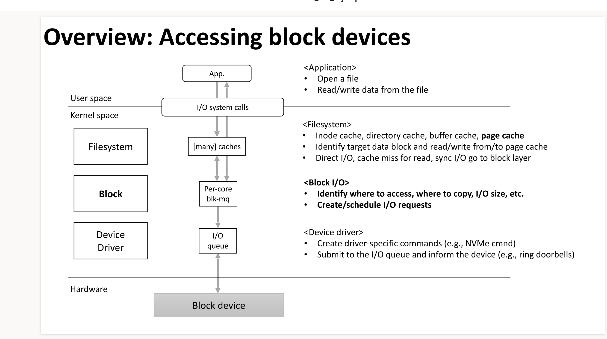
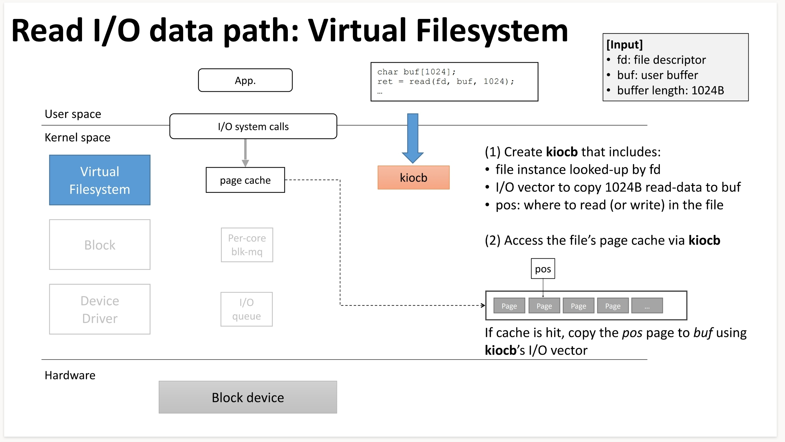
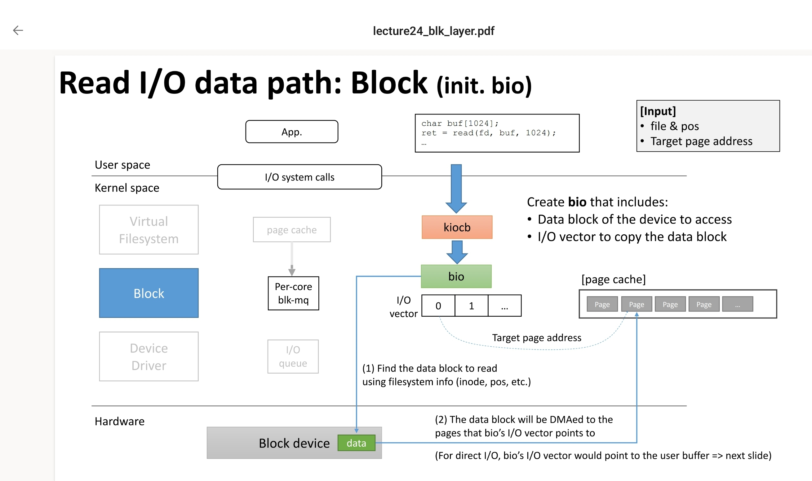
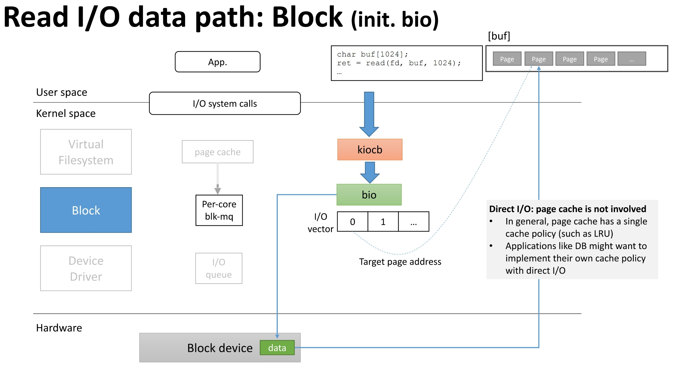
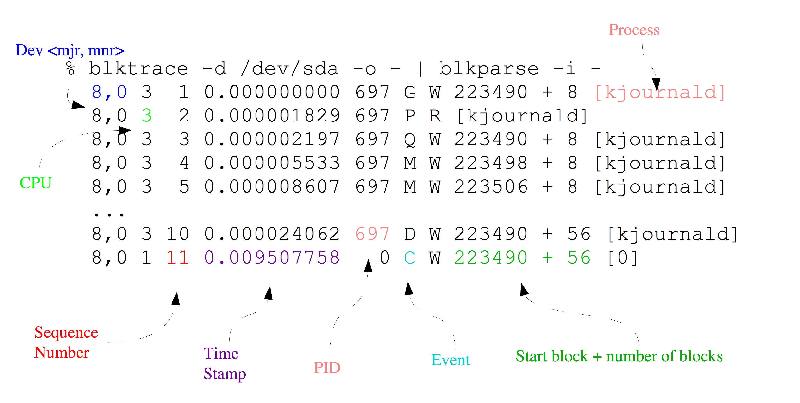
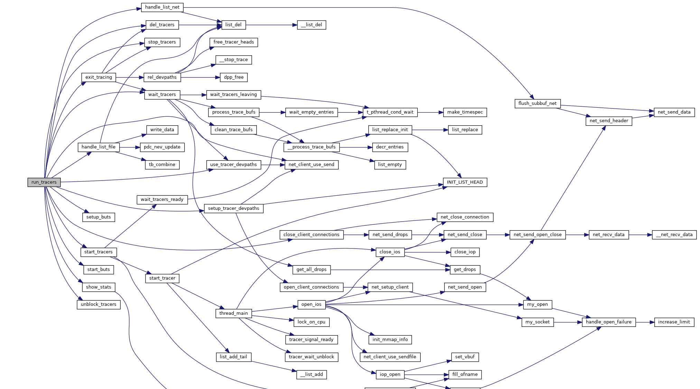

# 我的存储笔记
## 存储介质，产品

### 块设备
比如HDD，SSD，它们：
* 允许访问固定块的数据
* 固定块的数据被称为`blocks`：Block是由文件系统定义的最小的可寻址单元（大多数为4kb），见后文VFS部分

### 分布式存储
分布式存储主要包括文件、对象存储。典型的使用场景下，分布式存储组网由客户端，分布式文件/对象存储、万兆交换机、千兆交换机组成。客户端和存储产品通过万兆交换机连接（也可能是IB）。


## 存储理论
我们将从一次linux IO按照从前端到后端的顺序进行分解来看一下一个iO完成所需要经过的完整链路，按照如下顺序：
* syscall -> vfs(重点讲block-based fs)
* 

### 文件系统的实现
首先理论方面的学习，主要是先抽象出一个极简的文件系统,再看看现实中的案例。

#### 数据结构
文件系统在磁盘上使用什么类型的结构来组织数据和元数据
简单的文件系统可以是这样：


上图为一小块磁盘区域的数据内容，其中：
* 磁盘被分为64个小块(block)，每块大小为4KB
* "D"代表数据，为用户数据的代表
* "I"代表inode，为存放文件元数据的结构
* "d"代表数据位图和inode位图，是一种用于管理空闲块的数据结构
* "i"代表inode位图，用于管理inode块的数据结构
* "S"代表超级块，用于存储文件系统本身的信息

放大0-7数据块(管理结构)的内容：

假设说，我现在希望获取inode32的数据，通过计算得知我需要获得第20KB位（inode大小为256字节）的数据 -> 文件系统要索引这个字节位的数据。但是磁盘是由可寻址扇区组成的(固态硬盘使用闪存芯片存储数据，闪存芯片被分为多个可寻址的扇区，每个扇区都有唯一地址)，通常扇区是512字节，从而文件系统需要向40发出一个读取请求。

除了纯粹数据外的用户数据统称为元数据，设计inode时，最重要的决定之一是它如何引用数据块的位置，一个简单的方法是，将磁盘地址直接写入到inode中，使用这种方法有一个局限性是，对于很大的文件，将没有足够的空间来纳入这些地址。为了解决这类问题，人们想到了**多级索引**

分配一个块专门存其他块的地址，INODE设置12个（举例）直接指针和一个间接指针，一个块可以存1024个指针，则文件上限上涨至4144KB。想要继续扩容，则继续套娃。许多文件系统使用套娃（多级索引）的方法来满足文件大小上限的需求，比如ext2,ext3。

### 块I/O层
linux kernel有一个块IO层是块设备上层的“块抽象”，它像一层夹心饼干，在设备驱动和文件系统之间，文件系统对块设备的访问落到block layer就会变成一次'requests'。
大体上长这样：


我们看到块IO层其中一个作用是**找到哪里去访问以及拷贝，并确定IOSIZE**，我们得提一下page cache这个概念，即页缓存，首先声明一点：页缓存最重要的作用便是提高文件系统的性能，当应用程序读取文件（或者说使用read系统调用）时，正常的调用链，OS会去查看页缓存中是否存在page cache中了，如果有就直接从当中读取了，所以理所应当地，page cache会存在比磁盘访问性能更高的内存中，下面给出一些命令来让你更深切地感受到page cache的存在。

```shell
# 该命令可以查看到当前linux系统中，页缓存的size
cat /proc/meminfo | grep "Cached:"
```

关于块IO过程中的细节，可以看下文的`一次IO的代价`，这里我们讨论下，下发到驱动前，BIO对象中的"request"所包含的内容，我们先提出一些重要的问题：
* 我们知道文件层的io相关的信息：inode相关信息，按照request这个词本身的意义，我们想知道request会落到哪个设备
* 对于每个设备，一定会有多个`queue`，我们如何知道request落到哪个queue
* 细致考虑到执行过程，我们会想知道：这个req应该是由哪个cpu逻辑核来执行

带着这些问题，我们利用一些现成的工具来帮助我们回溯这个过程：即blktrace


### IO的应用层面分析

#### 一次IO的代价
首先我们看下linux下一次IO需要经过的路径：


我们分析一次read操作的执行序列：


而对于bio对象，则是这样,bio会携带vfs带来的关于IO块的信息，用于落到驱动去查询对应的数据，查到数据后会将数据放到page cache中（非direct iO的情况下）：


而对于Direct IO过程，请看图示：


可以看到在Block层有`blk-mq`，这一层的具体机制可以去看linux kernel文档：docs.kernel.org/block/blk-mq.html

##### blk-mq
多队列块IO排队机制依赖于现代存储设备的并行能力，


#### 通信层面-json和msgpack
json数据可能是用于数据交换任务中最常见的交换格式，我认为json的流行主要源于其`表达能力强`以及`人类可读性强`，在不伤害上面两个关键特性的前提下，我们考虑优化json数据交换的效率，其中一个非常有代表性的工作就是`msgpack`。

在msgpack官网就可以看到对于这种序列化方法的描述：本身实际是一种二进制交换格式。其中一些著名的软件如`redis`就使用了这一种数据交换格式。使用官方的demo你可以尝试将json数据变成msgpack（十六进制数）,并且能看到压缩比。所以事实上msgpack是一种序列化标准，它有两个组成部分：`类型系统`以及`格式`，序列化的过程试讲应用对象转换为msgpack格式，反之亦然。

首先，msgpack类型包括integer,nil,boolean,float,raw(包括string和binary,前者为utf8字符串，后者为字节阵列)，array代表一种对象的序列，map亦然，还有Extension类型。
Extension类型非常关键


#### 访问方法

#### 存储特征和存储应用设计


## 存储软件&分解&测试

### 存储追踪工具：blktrace
`blktrace`是块IO层级的追踪工具，当你要了解每个下发到块设备的IO操作时，blktrace是最合适的工具，该工具还服务于IO领域内的内核开发者
对比一下,blktrace和iostat：iostat提供了获取向目标设备的请求队列获取信息的能力，但并不覆盖每一个IO

blktrace是很多工具的基础：ioprof, seekwatcher, iowatcher，首先分析一下，一个IO请求，从应用层到块设备，路径如下：


blktrace重点分析的过程是block layer中的过程，因此对于block-io过程想要挖掘细节也可以参考这一部分。
我们考虑一个IO进入到block layer，会经历的过程：
* remap：io被device mapper（DM）或者multiple device（MD）映射到其他设备
* split：IO请求可能会因为扇区边界未对齐，size太大而被拆分成多个物理IO
* merge：可能会因为与其他IO请求的物理位置相邻而合并成一个IO
* 被IO Scheduler依照调度策略发送给driver
* 被driver提交给硬件，经过HBA，电缆，交换机（SAN），最后到达块设备，完成IO请求，将结果返回

blktrace可以将内核态的IO过程记录下来，来看一条典型的trace命令
```shell
blktrace -d /dev/sda -o - | blkparse -i -
```
将上述过程分解后表示则：
```
 Q------->G------------>I--------->M------------------->D----------------------------->C
 |-Q time-|-Insert time-|
 |--------- merge time ------------|-merge with other IO|
 |----------------scheduler time time-------------------|---driver,adapter,storagetime--|
 
 |----------------------- await time in iostat output ----------------------------------|
```
关于这些大写字母所代表的事件，我们在下面补充。

我们来分析blktrace的输出：


* 第一个字段：8,0 这个字段是设备号 major device ID和minor device ID。
* 第二个字段：3 表示CPU
* 第三个字段：11 序列号
* 第四个字段：0.009507758 Time Stamp是时间偏移
* 第五个字段：PID 本次IO对应的进程ID
* 第六个字段：Event，这个字段非常重要，反映了IO进行到了那一步
* 第七个字段：R表示 Read， W是Write，D表示block，B表示Barrier Operation
* 第八个字段：223490+56，表示的是起始block number 和 number of blocks，即我们常说的Offset 和 Size
* 第九个字段： 进程名

关于第六个字段的值，其可能的范围主要是这一些：
```
       A      IO was remapped to a different device
       B      IO bounced
       C      IO completion
       D      IO issued to driver
       F      IO front merged with request on queue
       G      Get request
       I      IO inserted onto request queue
       M      IO back merged with request on queue
       P      Plug request
       Q      IO handled by request queue code
       S      Sleep request
       T      Unplug due to timeout
       U      Unplug request
       X      Split
```
我们根据上面信息，来重新看下几个阶段的数据表征。

Q2G:生成IO请求所消耗的时间，包括remap和split;
G2I:IO进入IO Scheduler所消耗的时间，包括merge的时间；
I2D:IO在IO Scheduler中等待的时间；
D2C:IO在driver和硬件上所消耗的时间；
Q2C:整个IO请求所消耗的时间


#### 使用案例
我们可以根据自己的需求创建一种标准化的IO测试流程来更好地获取被测系统以及测试任务的特征，假设我们的目标程序可以通过shell方式唤醒，我们采用`事后分析`的方法，使用blktrace配合blkparse，btt等结果分析工具来协助分析。

首先，blktrace的目标是具体的块设备，默认输出文件名是<device>.blktrace.<cpu>，如果想要分析某个进程的执行结果怎么办呢，目前能想到的方法仍然是尽可能的让目标系统处于IDLE状态（控制其他服务，将非必须启用的服务都暂停），然后使用shell同时启动目标软件和blktrace

```shell
# 使用blktrace监控sda持续性20秒，解析结果存在/data目录下
blktrace -d /dev/sda -o /data -w 20

# 将per cpu结果合并为一个二进制结果
blkparse -i <device> -d <device>.blktrace.bin

# 使用btt进行阶段分析
btt -i <bin> -l <output>

# live模式分析
btrace /dev/sda
```

实际上用作分析最重要的软件是`btt`，btt工具能够提炼出的最具概括性的信息是在trace阶段获得的IO的上述各阶段的时间开销（最小值，平均值，最大值），其中有两个特别重要的阶段，即`D2C`和`Q2C`，前者表征了块设备本身的处理能力，如果D2C的MAX越大，代表设备的tail latency越高。后者代表的是一个IO请求在块层的全部时间，Q2C - D2C代表了内核软件栈的延迟。


#### 实现原理分析
这一小节记录的信息来源于网络上各路分析博客，作为下一小节-实现分析的预备部分。

首先看blktrace的实现，我们先参考其User Guide: allstar.jhuapl.edu/repo/p1/amd64/blktrace/doc/blktrace.pdf


btt分析的数据都是对于单一事件的记录，btt是如何做聚合的呢？


#### Doxygen-代码分析
首先讲下在doxygen wizard的界面上的配置改进，在`Mode`下`Select the desired extraction mode`中选择`All Entities`，同时勾中Include cross-referenced source code in the output，编程语言的优化则根据项目的语言配置来选择（如C/C++）。

输出主题下，HTML选择with navigation panel并勾选With search function；不必选择Latex（消耗生成时间，但是产物意义不大）

Diagrams下为了有更丰富的图例，选择GraphViz来生成目标，勾选所有Dot graphs

Project是BUILTIN—STL—SUPPORT，主要为CPP服务。BUILD中要讲`EXTRACT STATIC`和讲`EXTRACT PRIVATE`选中

BUILD下将`SHOW_GROUPED_MEMB_INC`勾选

Source Browser需要勾选REFERENCED_BY_RELATION,以及REFERENCES_RELATION

Dot是`DOT_GRAPH_MAX_NODES`修改为100，`UML_LOOK`需要勾选,`UML_LIMIT_NUM_FIELDS`修改为0。`TEMPLATE_RELATIONS`=yes

关于C++项目的配置优化，可以参考codeyarns.com/tech/2014-06-18-how-to-configure-doxygen-for-c-code.html。


我们按照上面的配置，来生成blktrace的doxygen文档。

可以看到main函数中关键的执行流就在于run_tracers，我们点击查看其调用关系：




blktrace.c文件的依赖中`blktrace_api.h`定义了关键的几个操作：
* BLKTRACESETUP
* BLKTRACESTART
* BLKTRACESTOP
* BLKTRACETEARDOWN

这些宏展开后是ioctl.h中系统调用的接口，用于设备驱动程序和用户空间程序间的通信。在启动blktrace的时候使用strace可以看到调用了ioctl的两个命令，即`BLKTRACESETUP`和`BLKTRACESTART`，


### 有哪些衡量指标
我们结合IO理论部分考虑这些可能的指标：
* 性能
    * 大IO带宽极限
    * 小IO带宽极限
    * IO延迟
* 能耗

### 测试基准＆测试
我们先从日常使用、企业级场景、压测这几个维度出发，去考虑三个场景下对于IO任务的一些需求，我们很难将所有场景覆盖完整，因为这个领域（数据存储）所覆盖的内容实在是过于庞大，因此我们从最常见的场景出发来考虑。

#### 个人用户的日常使用
* windows场景、linux场景都需要考虑
* 移动设备的测试需求
* 


#### 个人测试工具
* fio

##### IO-workload记录，回放工具


#### 企业使用的存储设备
企业市场一定是相对个人来说更加高端的场景（虽然像废话），我们考虑下对于企业来说，数据存储可能需要具备的特点：
* 高容错
* 容灾
* 超低时延
* 高容忍

#### 企业测试工具
* COSBench 0.4.2.c4
* Vdbench50406
* S3 Browser

##### 容量检测
步骤：
* 查看SUT文件/对象存储剩余裸容量A
* 使用vdbench向分布式文件/对象存储写入数据量为B的文件/对象数据，再查看剩余容量C
* 则评估有效容量： A*B / (A-C)

一般企业级的有效容量不低于1PB

##### 接口测试
测试NFS的文件接口是否正常工作，包括：
* 创建NFS协议挂在的共享目录
* 目录创建，重命名，删除；
* 文件创建，修改，移动，重命名，删除；
* 卸载共享目录/重新挂载

其他协议还有ftp（目录创建，重命名，文件上传，下载，删除）
Windows的CIFS（和NFS的测试类似）

测试S3接口，完成配置后，启动S3服务，通过S3 browser完成：
* 创建桶，上传对象，查看桶内对象；
* 下载上传的对象，查看对象是否一致；
* 删除桶对象，批量删除桶对象；
* 查看桶内对象是否被成功删除
* 删除桶

IPV4，IPV6网络测试

##### 功能测试
* 图形化管理
* 冗余策略配置
* 系统资源监控：CPU占用率，总空间，已用空间，读写带宽，读写IOPS
* 节点间的负载均衡：在客户端运行vdbench/cosbench，在5~10个目录下创建150~300个256~512MB的文件；1个桶内创建15000~30000个512MB的对象顺序写入。数据创建过程中查看各节点情况，单个节点需在该类节点均值的20%上下限内。
* 目录配额，为目录创建快照，WORM期特性
* 节点并发数设置

### 