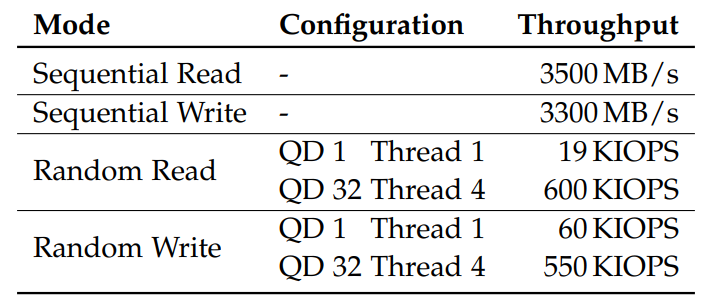

# 用户态NVM驱动
vroom是使用Rust实现的用户态的驱动程序，本身作为一个Proof of concept
跟这个相关的程序还包括redox操作系统的nvme驱动：
gitlab.redox-os.org/redox-os/drivers/-/tree/master/storage/nvmed

## 项目初衷
传统的Linux IO API或者是异步API没办法实现最低延迟或者最高吞吐量（因为它们的iO是基于内核的IO路径），而SPDK则提供了解决该问题的一套方案。vroom和它类似，但使用rust实现。

## 背景介绍
PCIe Gen 5.0 NVMe SSDs,理论上该设备可以做到一百万IOPS，而Linux的常规文件读写API，使用了pread和pwrite,其实没有办法真正发挥出它们的能力，看论文cidrdb.org/cidr2020/papers/p16-haas-cidr20.pdf,标题是如何在DBMS中最大化地利用NVMe

首先我们梳理出Linux OS可能带来的影响效率的因素：
* OS buffering(page cache, O_DIRECT)
* io interface(pread/pwrite, libaio, io_uring)
* file_system（ext4,btrfs,xfs,f2fs，对于直接写块设备而言，这一层可以忽略）
* RAID(硬件RAID)
* SPDK(跳过系统软件栈)

### OS buffering

这里有一个需要注意的点：
O_DIRECT和Fsync不是一样的东西，详情看percona.com/blog/fsync-performance-storage-devices

下面也来解释一下：
O_DIRECT：是一个创建文件的FLAG，如果使用O_DIRECT打开文件，那对其写入是否意味着当调用返回，数据就在磁盘上了？

**不是的**，这操作只是跳过了Linux提供的缓存机制，如果说，你打开的文件是块设备本身的话，该操作可能是符合预期的（即返回的时候直接就落盘了）。如果你要保证数据真的到了磁盘，你需要对fd执行`fdatasync()`或者使用`O_DSYNC`,如果你要确保元数据也被写入盘上，则需要使用`O_SYNC/fsync()`，注意，同步调用一般情况下是大部分应用的性能杀手。

那么什么时候使用比较好呢，除了基准测试场景外，应用本身如果有一个缓存层的话，将数据从磁盘读到页缓存再到应用就产生了多余的开销，这时候使用ODIRECT是不错的选择。


### io interface
pread和pwrite都是同步的读写操作，而异步的Linux IO系统调用有两个，一个是libaio: 不支持OS buffering，一个是io_uring，支持OS buffering。注意使用了异步的rw操作后，一个线程就可以完成多个线程同步操作的任务。但是如果涉及到OS buffering，一个逻辑核的cycle数可能不足以支持buffering的操作（所以这时候启用O_DIRECT,即采用libaio反而会有更好的性能，当然这需要你的任务是进行大范围/高并发的读写）


vroom横向对比的自然是其他这些IO引擎：libaio, io_uring, SPDK, psync


### 性能评估

测试配件：

* Intel Xeon E5-2660
* 251G RAM
* 1Tb Samusung Evo 970 Plus Nvme SSD(1gb cache)





benchmark:

```toml
[global]
io_engine={spdk,io_uring,libaio,psync}
rw={randread,randwrite,read,write}
blocksize=4k
direct=1
norandommap=1
runtime=900
numjobs={1,4}
queue_depth={1,32}
group_reporting=1
```

