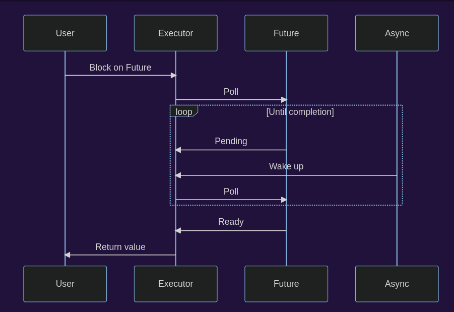
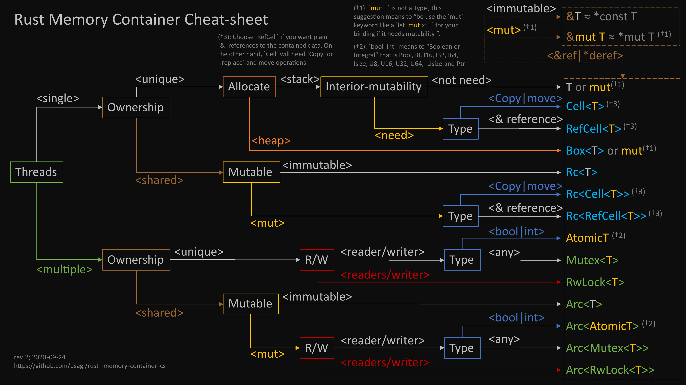

## async编程

编程模型上，rust的异步编程模型也是基于**async/await**的，而Rust的async模型有些独特的点：

* Future是在未来某个时间点被调度执行的任务，只有在被poll时才会运行
* async实现本身没有额外的运行时开销，不需要分配堆内存
* rust的异步调用运行时由第三方库提供，比如tokio
* 支持单线程和多线程

### 生态

rust异步生态中有三个著名的crate：Tokio, async-std,futures，它们之间的关系：

* `std::futures` 是实现 async/await 语法所需功能的标准库
* std::futures从futures-rs中发展出来
* tokio提供了一个具体的异步runtime，以及实用工具，用于处理IO类，Unix信号类，它是基于future-rs实现的

#### runtime-agnostic

### 异步模型

### Future

```rust
pub trait Future {
    type Output;

    fn poll(self: Pin<&mut Self>, cx: &mut Context<'_>) -> Poll<Self::Output>;
}
```

显然，Future这个trait是我们要面对的最重要的概念，首先Task代表着将要被**调度**的任务，想象一个CPU的时间片被拆分成一个环，我们把这个环暂且称为"event loop"，环上的资源（即CPU的时间）被各种任务塞满。



### runtime

首先我们提出一个问题：既然async可以有那么多不同runtime的实现，那么我们直接使用最好的作为标准库不就得了，就像python有asyncio，那rust也应该要有这么一个东西。

事实上，python内置的asyncio runtime并不一定是**最好的**，要不然就不会有那么多项目使用uvloop这个使用cython优化过后的event loop了。

## 线程模型

下面涉及的概念并不和语言绑定（C/C++），但会以Rust作为演示和讲解的主要语言。

### 你能获得什么

系列1：

* 了解什么是同步原语
* 对Sync以及Send更加深刻的认识，以及各种反例
* 多线程代码必知：move || {}，如何约束一个函数的类型（Fn）
* 底层并发概念：atmoic的使用：
  * 回答一个问题：原子操作 VS Mutex

系列2：

* 在Rust中实现atomic（x86-64）

### 从std::thread开始

要使用多线程，我们必然需要阅读标准库文档：https://doc.rust-lang.org/std/thread/

* 首先，rust的thread 基本等同于 native OS thread，即内核线程，因此我们知道每个线程都会附带栈空间，以及线程状态(local state)

* 一般来说，线程之间的通信，可以通过`std::sync::mpsc::channel`，即很多编程语言都会有的channel数据结构，或者是通过**共享内存**的数据结构，其中要使得一个对象线程安全，可以通过在其外层使用Arc(atomicallly-reference-counted container)

* 当Rust程序的主线程终止的时候，整个程序将停止工作，即使仍有作业中的其他线程。当然，通过join机制，我们可以让主线程等待工作线程终止后再停止。

#### spawn

```rust
#[stable(feature = "rust1", since = "1.0.0")]
pub fn spawn<F, T>(f: F) -> JoinHandle<T>
where
    F: FnOnce() -> T,
    F: Send + 'static,
    T: Send + 'static,
{
    Builder::new().spawn(f).expect("failed to spawn thread")
}
```

#### Thread类型

#### 同步原语

英文名称synchronization primitive，相信很多人都会听说互斥锁/事件等概念，并且很多博文也将这些概念统一为同步原语，那我们该如何以及为何要将一个概念归属于同步原语的范畴呢？

我的理解，同步原语是程序员在**操作系统提供的线程/进程机制之上**创造的同步工具。它可以是抽象的概念，比如我们说互斥锁就会想到不管任何编程语言，在实现多线程操作的时候，但有可能会触及到的抽象概念。

这一些概念可以参考这份清单：http://www.cs.columbia.edu/~hgs/os/sync.html

但在一些语境下，也有人会用这个词去描述同步工具的**实例**，即一个现实的例子，比如一个rust库的基本描述就是：

> Compact and efficient synchronization primitives for Rust. Also provides an API for creating custom synchronization primitives.

既然是工具，肯定是可以有不同实现的，但对于一门高级语言来说，最常被使用到的一般是标准库提供的同步原语，比如std::sync

### 并发相关的概念

我们要去回答一些问题：

* 原子操作和互斥锁，哪一个更加高效

#### Cell家族&智能指针

我们不会讨论所有的智能指针/跟内存相关的容器，讨论并发，必然要涉及到线程概念，一旦涉及到线程，必然会使用到memory container：



##### Cell

Cell是一个可共享的可变引用container(单线程情况下)

来看最重要的API：set的签名：

```rust

```

##### 回顾内部可变性

在不使用Cell的前提下实现内部可变性，其实都可以视作在用使用一种Cell变体（refcell, mutex）

#### sync, send

sync和send都是marker trait(未定义任何行为)，同时也是auto trait——通常会被编译器检查类型并自动实现。

我们先把这两个概念厘清。

```rust
#![feature(optin_builtin_traits)]

auto trait IsCool {}

// Everyone knows that `String`s just aren't cool
impl !IsCool for String {}

struct MyStruct;
struct HasAString(String);

fn check_cool<C: IsCool>(_: C) {}

fn main() {
    check_cool(42);
    check_cool(false);
    check_cool(MyStruct);

    // the trait bound `std::string::String: IsCool` is not satisfied
    // check_cool(String::new());

    // the trait bound `std::string::String: IsCool` is not satisfied in `HasAString`
    // check_cool(HasAString(String::new()));
}
```

* Send意味着类型可以在线程之间互相传递

* Sync意味着类型可以**同时**被多个线程引用

* 类型T的应用&T如果实现了Send，则T**必然**实现了Sync

* 但是Sync强调同时，另一方面可以看出，很少有类型是Sync而不是Send（但不是没有，比如）

* 由于这两个Trait可自动派生，从而当一个复合类型的所有成员都实现了Send/Sync，那么该类型自动就实现了Send/Sync

我们来看一些典型的反例：

* 裸指针：它的存在就意味着它没有任何的安全保障
* Cell家族全员不是Sync（因为UnsafeCell不是）
* Rc两者都不是（这就不得不联想到Python了，想想为啥PyObject不是线程安全的就知道了...）
* MutexGuard：是Sync但不是Send：其他线程可以访问该对象，但不能销毁该对象

Rc的例子：

```rust
impl<T> Drop for Rc<T> {
    fn drop(&mut self) {
        let current_count = &mut unsafe { &mut *self.inner }.count;
        if * cnt == 1 {
            let _ = unsafe { Box::from_raw(self.inner) };
        } else {
            *cnt -= 1
        }
    }
}
```

Rust给使用者们提供了打破限制的办法，那理所当然就是unsafe的（JoJo，我不想做人啦），我们会在后面的例子中看到实际案例（实现自旋锁的过程中，值得一提的是，像parking lot这样的同步原语库也必然会有类似的声明）：

```rust
unsafe impl<T> Sync for Mutex<T> where T: Send {}
```

##### 共享变量的条件

就拿上面的Mutex举例，这是共享数据结构的多线程模式，每一个线程获取的，是目标对象的引用类型，这就要求一般状况下，我们一定要求该类型实现了Sync

Arc是一种Rc, Arc<T>，如果T他是Sync，

#### move和闭包,Fn家族

我们知道闭包相当于一个捕获当前“环境”的匿名函数，它可以直接“拿”当前作用域中的变量来用，问题是它可以怎样去拿。

* 转移所有权
* 可变引用
* 不可变引用

##### 转移所有权

再回顾下move的使用方法：使得闭包取得捕获变量的所有权

```rust
fn test_move() {
    let data = vec![1, 2, 3];
    let closure = || {
        println!("{:?}", data);
    };
    // data is moved into closure, so it can't be used here
    println!("{:?}", data);
    closure();
}
```

上面这段代码没有问题，但如果使用move关键字：

```rust
...
    let closure = move || {
        println!("{:?}", data);
    };
    // data is moved into closure, so it can't be used here
```

在这个作用域中就不能再使用data了， 因为所有权已经被转移了

这时候会有一个问题，如果不使用move，那么闭包会如何捕获环境中的变量？

答案是尽可能的会捕获引用，下面是其优先顺序：

- Immutable borrow (`&T`).
- Unique immutable borrow (no syntax for that). This is used when the closure assigns to the captured variable but does not take a mutable reference to it (explicitly or implicitly, using method autoref). See [this section on the reference](https://doc.rust-lang.org/reference/types/closure.html#unique-immutable-borrows-in-captures) for more.
- Mutable borrows (`&mut T`).
- Move or copy (`T`).

被捕获的变量实现了Copy时，自然会发生拷贝

```rust
#[test]
fn test_by_copy() {
    let mut data = 3;
    let closure = move || {
        println!("{:?}", *&data as *const usize);
    };
    // data is moved into closure, so it can't be used here
    data += 1;
    println!("{:?}", *&data as *const usize);
    closure();
}
```

##### 不可变引用

```rust
#[test]
fn test_by_reference() {
    let data = 3;
    let closure = || {
        println!("{:?}", *&data as *const usize);
    };
    closure();
    println!("{:?}", *&data as *const usize);
}
```

##### FnOnce

“Once”代表**至少**能被使用一次，所以很好理解：

```rust
fn fn_once<F>(func: F)
    where
        F: FnOnce(usize) -> bool,
{
    println!("{}", func(3));
    println!("{}", func(4));
}
```

上述代码会编译错误，因为F**只有**FnOnce这个trait约束，所以在函数体当中被调用两次是错误的。


**注意，不是说实现了FnOnce的闭包一定获取的是目标的所有权，而是所有闭包都自动实现了FnOnce（所以当然可以获取引用）**

通过增加Copy约束，我们可以重复调用闭包：


##### FnMut

```rust
#[test]
fn test_fn_mut() {
    fn exec<'a, F: FnMut(&'a str)>(mut f: F) {
        f("hello");
        f(" world")
    }
    let mut s = String::new();
    let update_string =  |str| s.push_str(str);
    exec(update_string);
    println!("{:?}",s);
}
```

Fn就不必多说了，FnMut取的是可变引用，Fn取的就是不可变引用

#### atmoic operation

* 解释原子操作的必要性
* 看官方文档
* 实现Mutex
* 关于重排和Ordering语义

官方文档定义了很多原子类型，确保这些类型的实例在多线程的环境中不会触发data race进而引起的未定义行为

以`AtomicUsize`为例，我们看一下文档：

> pub fn [load](https://doc.rust-lang.org/std/sync/atomic/struct.AtomicUsize.html#method.load)(&self, order: [Ordering](https://doc.rust-lang.org/std/sync/atomic/enum.Ordering.html)) -> [usize](https://doc.rust-lang.org/std/primitive.usize.html)
> 
> Loads a value from the atomic integer.
> 
> `load` takes an [`Ordering`](https://doc.rust-lang.org/std/sync/atomic/enum.Ordering.html) argument which describes the memory ordering of this operation. Possible values are [`SeqCst`](https://doc.rust-lang.org/std/sync/atomic/enum.Ordering.html#variant.SeqCst), [`Acquire`](https://doc.rust-lang.org/std/sync/atomic/enum.Ordering.html#variant.Acquire) and [`Relaxed`](https://doc.rust-lang.org/std/sync/atomic/enum.Ordering.html#variant.Relaxed).

首先我们看到：载入Atomic的usize的Load方法传递的是引用（&self）

而第二个参数`ordering`,请看下面的小节，现在我们先不去考虑它到底是什么

##### 实现Mutex

我们考虑使用AtomicBool来实现一个Mutex:

```rust
struct Mutex<T> {
    locked: AtomicBool,
    v: UnsafeCell<T>,
}

impl<T> Mutex<T> {
    pub fn new(t: T) -> Self {
        Self {
            locked: AtomicBool:new(False),
            v: UnsafeCell::new(t),
        }
    }

    // 不能编译：不知道load的Ordering参数该是啥
    pub fn with_lock<R>(f: impl FnOnce(&mut T) -> R) -> R {
        while self.locked.load() == True {}
        self.locked.store(True);
        let ret = f(unsafe {&mut *self.v.get()});
        self.locked.store(False);
        ret
    }
}
```

存在的几点问题：

* Ordering参数
* 自旋锁（我们后面解决）
* 仍然会出现data race

现在我们依旧不知道Ordering咋写，既然不知道，干脆就随便选一个Ordering:relaxed

我们为了复现第三个问题，可以这样修改：

```rust
while self.locked.load(Ordering::Relaxed)! = False{}
std::thread::yield_now();
self.locked.store(True, Ordering::Relaxed);
```

线程在进入临界区之后立刻将时间片归还给内核，此时假如这颗CPU核被其他线程占用，恰巧它此时进入了和当前线程一样的代码段，那两者会同时完成取值以及各自的函数调用，那么一个函数调用的副作用则可能完全被另外一个线程的操作覆盖掉（比如数值加法）。这就相当于触发了未定义行为。

显然，为了解决这个问题，我们得用一些特殊的原子指令（test and set），而参考文档，我们也找到了这个函数调用，修改一下代码，我们有：

```rust
while self.locked.compare_exchange(False, True, Ordering::Relaxed, Ordering::Relaxed).is_err() {
    while self.locked.load(Ordering::Relaxed) == False {}
}
```

##### Ordering

```rust
#[non_exhaustive]pub enum Ordering {
    Relaxed,
    Release,
    Acquire,
    AcqRel,
    SeqCst,
}
```

先来看一段代码：

```rust
#[test]
fn too_relaxed() {
    use std::sync::atomic::AtomicUsize;
     let x: &'static _ = Box::leak(Box::new(AtomicUsize::new(0)));
    let y: &'static _ = Box::leak(Box::new(AtomicUsize::new(0)));
    let t1 = spawn(move || {
        let r1 = y.load(Ordering::Relaxed);
        x.store(r1, Ordering::Relaxed);
        r1
        }
    );
    let t2 = spawn(move || {
        let r2 = y.load(Ordering::Relaxed);
        x.store(42, Ordering::Relaxed);
        r2
        }
    );
    let r1 = t1.join().unwrap();
    let r2 = t2.join().unwrap();
}
```

先来说下 Box::leak将阻止Box对象的Drop被调用，从而将一个值的生命周期转换为'static，但同时，该值也是在运行时被创建，那它有什么用呢？

比如有一项配置的结构体实例，需要被动态创建，并且会被一直使用，那么这就是Box::leak的一个不错使用场景。

上面代码有一个比较逆天的可能性：就是r1有可能 == r2 == 42，即对于t2而言，x.store的操作可能会发生在r2 = y.load之前。这是因为代码重排了。

在t2的视角下，两个语句之间并没有直接的数据关联。那么编译器有可能会因为性能的原因重排赋值的机器码。

如果要杜绝这种情况的发生，就是主动告诉编译器**以及CPU**：你不能这样重排

事实上，除了编译器，硬件本身也具有重排机器码的能力。 

问题是：**不能怎样重排**

这个保证需要通过一种机制去实现，这就是Ordering存在的意义，这部分的解释可以看https://doc.rust-lang.org/nomicon/atomics.html，Rust的内存模型实际直接继承了CPP20，所以你也可以看https://en.cppreference.com/w/cpp/atomic/memory_order，这会更详细一些。

**It is literally impossible to write correct synchronized code using only data accesses.**

理解Accquire和Release，直接从锁的角度去看就没问题了，它们分别代表

就着上面的例子，我们来考虑如何修改代码以防出现未定义行为。

##### 实现atmoic

#### 回答问题

> 互斥锁和原子操作孰更高效

原子操作的实现直接依赖于特殊的CPU指令(compare and swap)，使用原子指令，并不会阻碍其他线程工作，但锁就不是了，这里有一个细节在于：使用非自旋锁机制，其他线程会释放CPU资源，重新启动线程时，伴随着上下文切换的开销，但尝试原子操作的线程则会一直尝试知道成功，因此一般来说，原子操作的执行效率会更高。

当然，我们可以从另一个角度来审视这个问题：你所使用的任何锁机制，它一定要用到原子指令来完成：

* 一定需要compare-and-swap原子操作来获得锁
* 一定需要store操作来释放锁

所以你至少也需要两倍于原子操作的时间。

## GPU编程

### 图形学&vulkan
