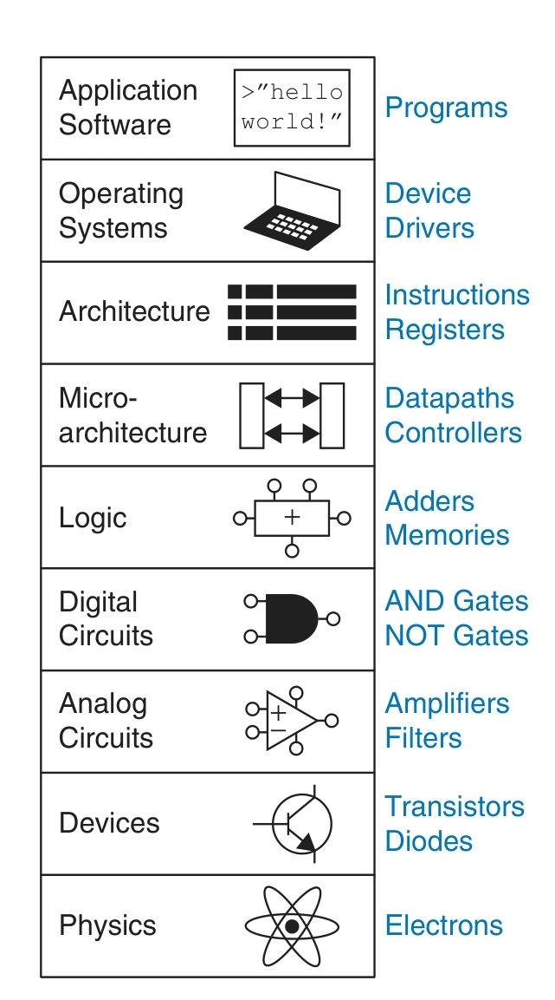

## 基础知识

### 管理复杂性的艺术
当代数字系统基于数百万计甚至是数亿计的晶体管构成，没有人类可以通过描述电子运动的方程式来理解这些系统，甚至连方程式的精确解是不可能得到的，因此管理复杂性的能力非常重要。

#### 构造抽象

最底层的抽象是物理：电子的移动，其行为通过量子力学以及麦克斯韦方程组来描述，而后我们的设备由电子设备构成：比如晶体管，每次我们往上移动一个等级，我们就可以忽略更底层级的细节，比如在电子设备级别我们就不需要看电子的移动

#### Discipline
什么是纪律，原文的解释：对设计有意添加的限制，以此来让高层级抽象的设计变得更加高效。一种典例就是可更换的零部件，对零部件设定标准，从而更高层级的抽象可以有效地设计出一些设计。

#### 3-Y’s
这个原则适用于软件和硬件设计，3个YS指的是：
* Hierarchy：分层级，比如来复枪可以分为`Stock`，`Lock`,`Barrel`
* Modularity：分模块-模块有良好定义的功能以及接口
* Regularity：

### 数字抽象和数字系统
多数物理量的定义原本都是连续的，但是数字系统，代表的是离散区间中的离散变量，Boole发明了一套对于二进制变量的逻辑计算系统，即`布尔逻辑`。

#### signed
字如其义，符号数值就是用来表示负数的，Nbit的符号数值使用最大位用作表示符号，其余的N-1位用于表示量。对于5而言，101是其二进制表示，则-5的二进制表示为1101（0代表正数，1代表负数）

不幸的是，常规的二进制加法并不是用于带符号的数值，另一方面，0如何用signed符号来表示呢？为了解决这些问题，我们有2位补码表示：

$2_{10} = 0010_{2}$

$-2_{10} = 1110_{2}$

这是如何得到的呢，首先我们倒置$0010_{2}$得到$1101_{2}$，从而0有了唯一表示，从而最小负数则为$10...000_{2}$，这种特殊的编码方式称为补码，这种方式最大的优势在于加法的规则重新生效了。重新看待取负的操作：倒置，然后+1，负数取绝对值则相反：-1，再倒置，你会发现这两种操作作用于0都是一样的。当然，使用补码的方式，其能够表示的范围则是$[-2^{N-1}, 2^{N-1}-1]$

### 逻辑门
逻辑门是一种简单的数字电路，输入一个或更多二进制输入，产生二进制输出。

### 数字抽象的意义

