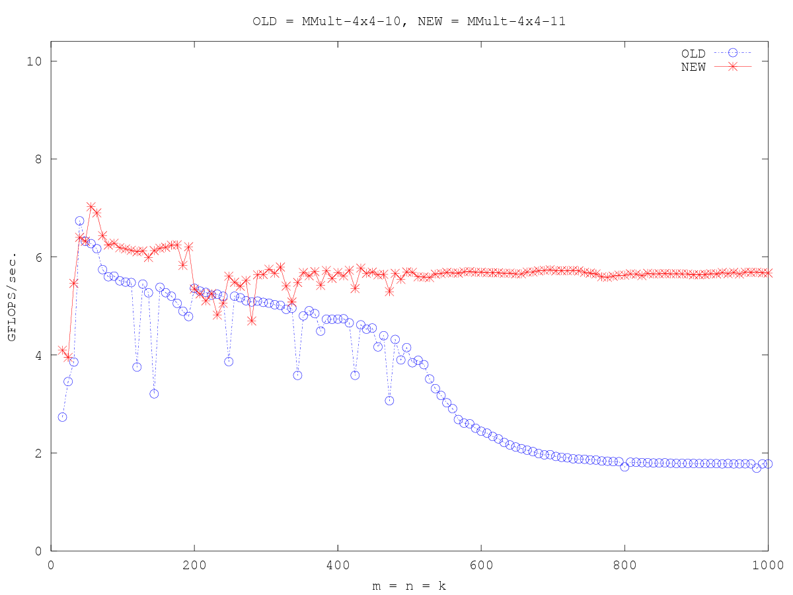
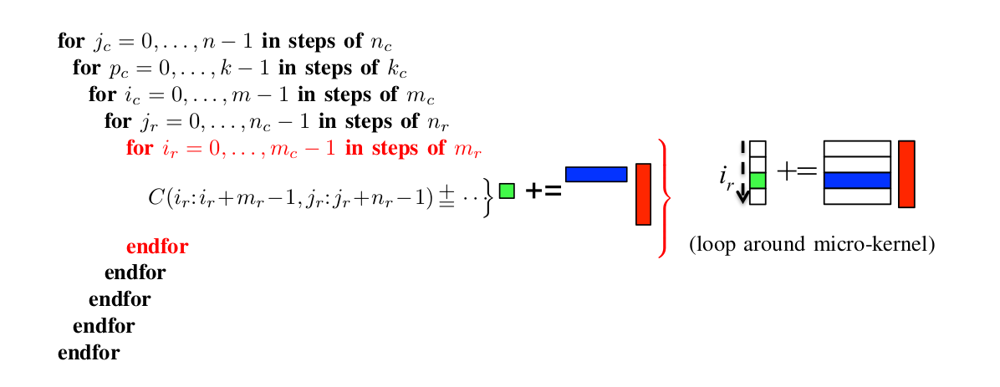
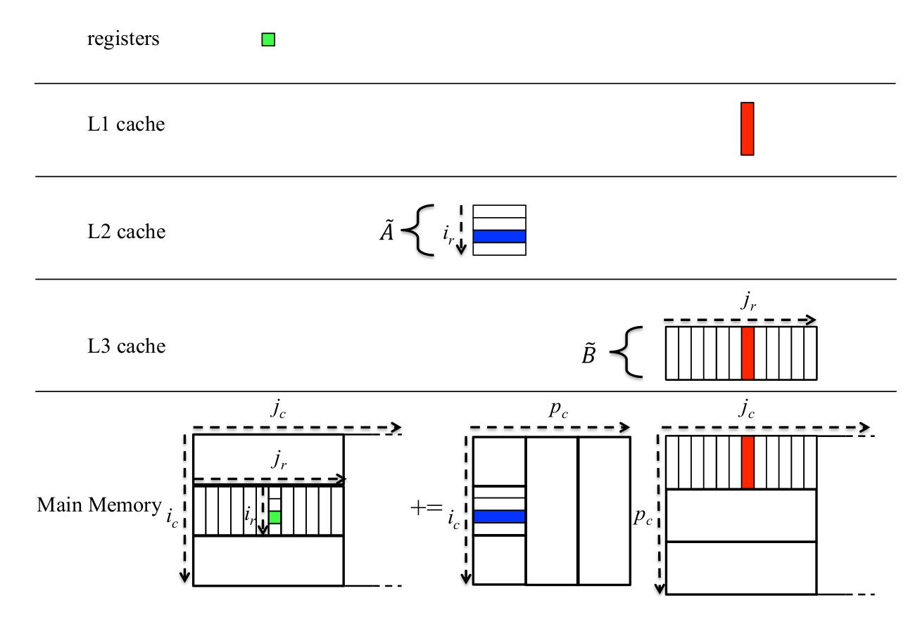

通过阅读该文，我认为你将收获什么：

* 你会知道微架构层面上矩阵乘法的优化方法
* 得到实现高性能CPU算法的一些思路
* 了解rust高性能编程相关的细节
* 接轨rust深度学习框架课程内容

## 了解一些微架构内容

了解一些基本名词：

* Word: 内存中的最小可寻址单元
* 

## 矩阵乘法微架构优化思路

我们将目光放在矩阵乘分解后的微内核gebp上

这些优化思路的理论部分可以去看两篇论文：

* 
* 

* 

将优化算法落地，代码成果如下：

* 
* [从学术界落地到工业界，数值库BLIS]()
* [BLIS对于Kernel实现的文档](https://github.com/flame/blis/blob/master/docs/KernelsHowTo.md#implementation-notes-for-gemm)

矩阵乘算法在微架构上的可视化：

待补充

### packed buffer

打包内存段，最主要的目的就是：

分块矩阵/子矩阵中的元素并不是连续的内存段。因此进行索引的过程比最小的TLB通道要大。解决方案是将分块矩阵打包到一段连续的内存中

### micro-kernel

所谓的微内核，可以这样理解，矩阵size小的时候gemm性能很好，因为内存读写的压力很小，当size大了，性能会降低。实现一个kernel使得，这个规定尺寸下的gemm有很好的性能，将任意问题规模下的gemm分解成多个微内核的执行。该方法使得峰值性能得以维持，实现上，需要两步：

* blocking
* execute kernel

上面的benchmark:

https://github.com/flame/how-to-optimize-gemm/wiki/Optimization_4x4_11

#### 如何blocking

分块的目的是让循环中复用的数据能够被放在更高速的存储单元上。

在论文*Anatomy of High-Performance Matrix Multiplication*中，分块顺序（可以理解为循环的顺序）为（文字描述配合图片一起看比较直观）：

* 将B,C按列进行分块，分块之后，B和C变成了一条条的column panels，宽度为$n_c$
* 紧接着，A被分块成column panels，而B的column panels们再次被分块，变成row panels，两类panels的宽度都是$k_c$，与此同时，将$B$子矩阵进行打包，**被打包的B将被安排到L3 cache中**
* 这时候再对A的column panels进行分块，变成一个个block，其纵向长度为$mc$，横向长度则是上一个循环中的$k_c$，**这时候将该block置入L2缓存**
* 后面的**两个循环**放在一起说，因为他们共同构成了最终C的小块，A再次以$m_r$为步长在纵向上被分长了一个个小块$m_r * k_c$，而B则是被分成$k_c * n_r$的小块(**这个小块在L1 cache上**)，最后再执行具有硬件亲和性的**micro kernel**，将其结果和现在的C小块**不断相加**即可，注意，**C小块在寄存器上**

下图为ndarray作者画的图

论文提出者的配图（老实说我觉得ndarray作者的涂鸦更加直观（狗头））

另外，我们应该也留意下存储层级的安排，这是高性能的关键：

#### 为什么这样blocking

回顾一下上文微架构内容中的部分以及上文提到的GOTOBLAS的最终方案，现在的情况是，通过看论文和开源实现，我们有了一个实践层面上优化的特别好的算法，这就好像知道了是一道题的标准答案，但问题是我还不知道这为什么会是标准答案，因此这一节我们就来讨论这个问题。

我们先梳理一下当前存在的问题：

* 是否可以以及如何将GEMM分解过程进行归类，依据是什么
* 为何要像上图中那样去进行CPU缓存与主存的分配
* 实现的程序中如何完成那样的分配

查阅论文的5.6 discussion，围绕着六种算法变体进行了讨论。

首先，一共有6种值得讨论的分块方法，它们的分解关系如下(图略丑，简单看看就好，详情还是看论文)：

```mermaid
graph TD
	A[GEMM]--> B1(GEPP)
	A[GEMM]--> B2(GEMP)
	A[GEMM]--> B3(GEPM)
	B1[GEPP]--> C1(GEBP)
	B1[GEPP]--> C2(GEPB)
	B2(GEMP)--> C2(GEPB)
	B2(GEMP)--> C3(GEPDOT)
	B3(GEPM)--> C3(GEPDOT)
	B3(GEPM)--> C1(GEBP)
```

到这里我有一些迷惑，虽然论文给出了明确的分解方法，但我不明白**为何要这样分，依据是什么**

因此我去了解了一些可能相关的背景知识(核心论文的**INTRODUCTION**部分提到的参考文献)：

[GEMM家族](https://www.cs.utexas.edu/~pingali/CS395T/2013fa/papers/MMMvdg.pdf)

看完论文后，我总结了一下理解论文的两个“口诀”来理解GEMM家族：抓住**不变形**和**对称性**

所谓不变性，是指对于原矩阵亦或是分块的矩阵，其组成部分的基本公式都是

$$C = A * B + C$$

对比论文中**Algorithm**中的伪代码，看出实际是数据复用对象的区别（即哪个对象被优先拷贝到上一层级中来完成计算）

优秀性能的关键在于这几个点：

1. L2 cache的最佳带宽：这意味着需要首先排除GEPDOT-based实现(下图)：
1. s
1. 

GOTOBLAS所采用的通过GEBP实现GEPP将$\tilde{A}$的尺寸都最大化了，通过将GFMM分解为GEPP_VAR1，

读者希望对上面的gemm_loop过程进行更详细的拆解和审阅，可以看(这些材料中所使用的符号是一致的)

* 论文*Anatomy of High-Performance Many-Threaded Matrix Multiplication*第二小结*BLIS*
* rust高效gemm开源实现*MatrixMultiply*库（Ndarray和Nalgebra）依赖的实现，文件名gemm.rs，函数为*gemm_loop*
* 

#### 微内核的实现

### thread pool

