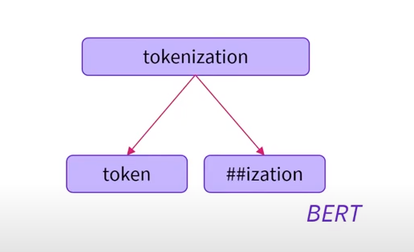
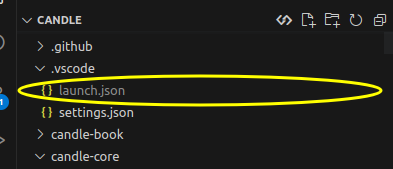

# candle源码学习

## candle介绍

candle是huggingface提出的深度学习框架，目前已经支持了市场上主流的模型，详情：

https://github.com/huggingface/candle

Candle 的设计理念围绕以下几个核心特性：

1. **简洁的语法**：类似于 PyTorch 的 API 设计，便于快速上手。
2. **多后端支持**：包括优化的 CPU 后端、Mac 的 Accelerate 后端、支持 CUDA 的 GPU 后端，以及 WebAssembly (WASM) 支持，允许模型直接在浏览器中运行。
3. **丰富的预训练模型**：支持多种流行的深度学习模型，涵盖大型语言模型、计算机视觉模型、音频模型和多模态模型。
4. **量化支持**：支持与 llama.cpp 相同的量化技术，可显著降低模型内存占用。
5. **文件格式支持**：支持加载多种格式的模型文件，包括 safetensors、npz、ggml 或 PyTorch 格式。
6. **无服务器部署**：支持轻量级、快速的 CPU 部署。


candle的核心作用：

* 轻量部署/推理
* 消除python栈，忽视掉gil一类的问题


1. **candle-core**：定义了核心操作、设备抽象和 `Tensor` 结构体。
2. **candle-nn**：提供构建神经网络模型所需的工具。
3. **candle-kernels**：包含 CUDA 自定义内核。
4. **candle-datasets**：实现数据集和数据加载器。
5. **candle-transformers**：提供 Transformer 相关的实用工具。
6. **candle-flash-attn**：实现 Flash Attention v2 层。


调试要点：

* rust-analyzer + vscode
* 调CPU backend的
* 围绕官方测试用例
* 应用围绕llama3


## 计划内容

* candle-tensor的设计：
  * ~~dtype~~
  * ~~tensor的统一存储字段：storage~~
  * ~~tensor的构造方法~~
  * ~~内部可变性,内存拷贝设计（内存调试）~~
  * ~~layout字段如何与storage配合~~
  * ~~tensor的indexing实现~~
  * broadcast实现
    * ~~基本思路~~
    * broadcast_binary_op
    * stride变化
  * issue2499问题定位
  * 算子实现（围绕cpu-binary op）
    * ~~算子注册~~
    * ~~模块层次~~
    * 性能优化相关设计
    * 自定义算子
    * 反向传播（引子）
  * 常见API（view..）
* backpropagation设计
  * 自动微分技术
  * thinc的设计
  * candle的设计
  * julia, pytorch的设计
* 从模型加载到forward
  * 加载Safetensor文件
  * VarBuild以及SimpleBackend
    * 技术点：零拷贝反序列化
  * 推理过程的Tensor提取
  * 零拷贝反序列化（大量实例代码）
    * Cow
      * rust中的Cow container
      * Cow原理
      * `* Cow的紧密优化`
    * mmap
    * 擦除技术
      * dyn-类型擦除
      * Yoke-生命期擦除（重点）
      * `* Yoke的实现原理`
* 实战：表格转换工具
  * ~~使用transformers模型Trocr~~
  * 实现TableTransformer


## 对比其他框架

| Using PyTorch | Using Candle                        |                                                              |
| ------------- | ----------------------------------- | ------------------------------------------------------------ |
| Creation      | `torch.Tensor([[1, 2], [3, 4]])`    | `Tensor::new(&[[1f32, 2.], [3., 4.]], &Device::Cpu)?`        |
| Creation      | `torch.zeros((2, 2))`               | `Tensor::zeros((2, 2), DType::F32, &Device::Cpu)?`           |
| Indexing      | `tensor[:, :4]`                     | `tensor.i((.., ..4))?`                                       |
| Operations    | `tensor.view((2, 2))`               | `tensor.reshape((2, 2))?`                                    |
| Operations    | `a.matmul(b)`                       | `a.matmul(&b)?`                                              |
| Arithmetic    | `a + b`                             | `&a + &b`                                                    |
| Device        | `tensor.to(device="cuda")`          | `tensor.to_device(&Device::new_cuda(0)?)?`                   |
| Dtype         | `tensor.to(dtype=torch.float16)`    | `tensor.to_dtype(&DType::F16)?`                              |
| Saving        | `torch.save({"A": A}, "model.bin")` | `candle::safetensors::save(&HashMap::from([("A", A)]), "model.safetensors")?` |
| Loading       | `weights = torch.load("model.bin")` | `candle::safetensors::load("model.safetensors", &device)`    |


## 必备技能

### 理解一些必要的概念

#### tokenizer

可以理解为由raw text到token序列的工具（rule based mapping），那可以联想到有：

* 基于单词-word based
* 基于字符-character based
* 基于子单词-subword based


一些例子：




后面会专门讲bytelevel bpe相关的内容


#### beit, roberta


这俩都是预训练好的模型

beit是通过自监督训练出来的


#### safetensor

其实就是hf开发的用来分发模型参数的一种通用格式/库，它们自认为当前各种格式的优劣如下：

| Format                  | Safe | Zero-copy | Lazy loading | No file size limit | Layout control | Flexibility | Bfloat16/Fp8 |
| ----------------------- | ---- | --------- | ------------ | ------------------ | -------------- | ----------- | ------------ |
| pickle (PyTorch)        | ✗    | ✗         | ✗            | 🗸                  | ✗              | 🗸           | 🗸            |
| H5 (Tensorflow)         | 🗸    | ✗         | 🗸            | 🗸                  | ~              | ~           | ✗            |
| SavedModel (Tensorflow) | 🗸    | ✗         | ✗            | 🗸                  | 🗸              | ✗           | 🗸            |
| MsgPack (flax)          | 🗸    | 🗸         | ✗            | 🗸                  | ✗              | ✗           | 🗸            |
| Protobuf (ONNX)         | 🗸    | ✗         | ✗            | ✗                  | ✗              | ✗           | 🗸            |
| Cap'n'Proto             | 🗸    | 🗸         | ~            | 🗸                  | 🗸              | ~           | ✗            |
| Arrow                   | ?    | ?         | ?            | ?                  | ?              | ?           | ✗            |
| Numpy (npy,npz)         | 🗸    | ?         | ?            | ✗                  | 🗸              | ✗           | ✗            |
| pdparams (Paddle)       | ✗    | ✗         | ✗            | 🗸                  | ✗              | 🗸           | 🗸            |
| SafeTensors             | 🗸    | 🗸         | 🗸            | 🗸                  | 🗸              | ✗           | 🗸            |

* 防止DOS (Denial of Service) 攻击：一方面，通过限制文件头大小为100MB以阻止极端大JSON的生成。另一方面，当读取文件时，限制文件地址不被覆盖，使其在载入过程中不会在内存中超出文件大小。

* 载入更快：对机器学习常用格式中，PyTorch似乎是加载最快的文件格式。而Safetensors通过跳过额外的CPU拷贝，在常规Linux硬件上的载入速度是PyTorch的2倍。    

* [惰性加载](https://zhida.zhihu.com/search?content_id=560029721&content_type=Answer&match_order=1&q=惰性加载&zhida_source=entity)：在多节点或多GPU的分布式设置下，不同模型可以仅仅加载文件中的部分tensors。例如使用 8 GPU载入[BLOOM](https://link.zhihu.com/?target=https%3A//huggingface.co/bigscience/bloom)模型的时间可以从用常规PyTorch的10分钟降至45秒。


## 调试代码

我使用的IDE是vscode + rust analyzer +codelldb，我推荐大家也是用这一套配置，开发调试比较丝滑

在安装好vscode之后，需要安装好相应的扩展：


关于如何配置launch.json，会在视频短片里进行介绍




### 踩坑

#### hf_hub api问题

使用api获取资源的时候，proxy无法生效去


简单的解法是将资源提前下载并将配置硬编码到main函数中，始终不是长久之计

可能的解决方法是将http代理切换到sock5（未尝试），讨论的相关issue在https://github.com/huggingface/hf-hub/issues/41

还有一个方法就是看该项目支不支持镜像，如果支持的话修改一个配置就可以解决该问题/自己给项目增加一个修改配置的入口


#### encoder维度没有对齐


调试代码，找到position_embeddings初始化的地方


```rust
let patch_embeddings = PatchEmbeddings::new(cfg, vb.pp("patch_embeddings"))?;
let num_patches = patch_embeddings.num_patches;
let position_embeddings =
    vb.get((1, num_patches + 1, hidden_size), "position_embeddings")?;
```

得知这个值为patch_embedding的num_patches，这是个什么呢？


在Transformer架构中，特别是在处理视觉任务（如图像识别）时，"Patch Embedding" 是一个重要的概念。它涉及到将图像分割成小块（patches），然后将这些小块转换成固定维度的向量，以便Transformer模型可以处理。


那么看一下PatchEmbeddings的初始化代码：

```rust
impl PatchEmbeddings {
    fn new(cfg: &Config, vb: VarBuilder) -> Result<Self> {
        let image_size = cfg.image_size;
        let patch_size = cfg.patch_size;
        let num_patches = (image_size / patch_size) * (image_size / patch_size);
        let conv_cfg = candle_nn::Conv2dConfig {
            stride: patch_size,
            ..Default::default()
        };
        let projection = conv2d(
            cfg.num_channels,
            cfg.hidden_size,
            patch_size,
            conv_cfg,
            vb.pp("projection"),
        )?;
        Ok(Self {
            num_patches,
            projection,
        })
    }
}
```


这样看起来，模型的大的这一个有点奇怪，由于我当前使用的是[trocr-small-printed](https://huggingface.co/microsoft/trocr-small-printed)模型，有可能是配置的问题，于是我考虑使用大亿些的


## 你可以收获什么

* 了解Candle是怎样获取模型的权重的

* 模型初始化过程中，Candle怎样检索Tensor

* 了解到Cow，Mmap等零拷贝反序列化常涉及到的名词，Rust中怎样使用

* Rust中如何通过生命期擦除实现零拷贝反序列化

  
