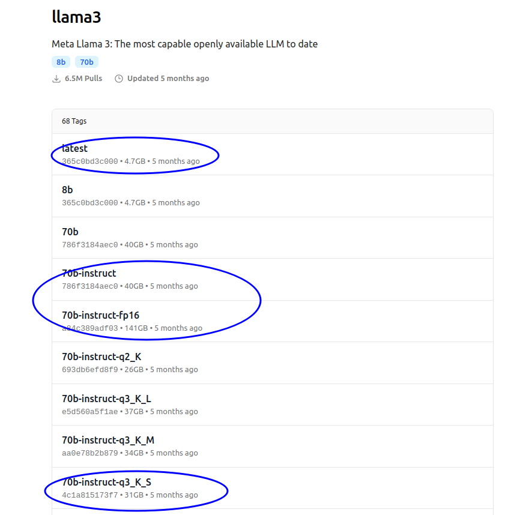

# local llm

## 为什么

AI很牛，现代人都见证了这个事实

大部分普通人使用的都是“云上”的AI，比如我们耳熟能详的chatgpt云云

当然，很多人也了解到有一些大模型是开源的，比如这当中最具名气的llama

我们可以很轻松地在自己的设备上部署并运行一个llm，让它为我们服务，问题来了：对于个人而言，有一个能够在本地运行的LLM是否重要，这对普通人来说是否可能？

我认为**重要**：

我认为可能：

## 硬件

这里开始主要是算账

本视频用于抛砖引玉，很希望听到大家讨论，如果觉得我在胡说，希望轻喷

对于我个人而言（应该对于大多数人来说是一样的），训练是不可能的，这辈子都不可能的（下辈子应该也不可能），现阶段SOTA模型不管啥领域基本都是大规模训练，这个趋势基本不会有啥变化，大规模训练的硬件我在工作中有微微接触过，目前很多都是迁移到智算中心，简言之就是带XPU的集群超算，训练中最大的问题一般是**带宽**，所以集群的互联效率是重中之重，工业界T0基本是nvlink组合，infiniband云云，大家可以去了解下价格（除了硬件，还有电费的）。再说几个点：

* A100等T0卡是限购的
* 这不是有开源模型吗-llama3，stable diffusion

那我们需要考虑的场景，最最主要的肯定就是**推理**了，其次，微调。

大家可能觉得企业用的企业级显卡肯定是最合适，实则不然，下面开始算账

### 模型规模

VRAM满足要求我们再考虑效率，来看看现在的大模型需要啥条件

[^llama3的基础条件]: https://ollama.com/library/llama3/tags

：

以`70b-instruct-q3_K_S`为例，我们说下这个命名的意思：

* 70b 表示这个模型有 700 亿（70 Billion）个参数。
* `instruct` 表示这个模型是一个指令微调模型，通常用于处理指令和任务，例如回答问题或执行特定的指令
* 量化方法
  * **q3**：表示使用 3 位量化。这意味着模型的权重被量化为 3 位
  * **K**：表示使用 K-quant 方法。这是一种更智能的量化方法，可以在不同层使用不同的精度，以比传统量化更智能的方式分配比特
  * **S**：表示使用 Stream 量化模型。这意味着模型是以流式方式加载的，而不是使用内存映射。在流式加载中，模型文件是按需读取的，相关部分被逐步加载到内存中，从而降低运行内存要求

现在讲下vram计算方法：

LLaMA3 70B-fp16

FP16则每个参数占用2个字节内存，

$70.6×10^9×2 bytes=141.2 GB$

我们以运行llama3推理模型的vram需求作为基线，可以看到3个圈：

* 8b:4.7GB（大部分消费级的卡都能跑）
* 70b-instruct-q3_K_S:（消费级显卡似乎能摸到边了）
* 70b

问题来了：消费级显卡能不能跑70b，上链接！

[24gb显卡流畅运行llama3-70b]: https://www.reddit.com/r/LocalLLaMA/comments/1cj4det/llama_3_70b_instruct_works_surprisingly_well_on/
[llm-benchmark]: https://github.com/XiongjieDai/GPU-Benchmarks-on-LLM-Inference

省流：

可以

更加细致的答案：

https://www.reddit.com/r/LocalLLaMA/comments/1cgo1tz/llama_3_hardware_recommendation_help/

> I've done some consulting on this and I found the best way is to break it down piece by piece, and hopefully offer some solutions and alternatives for the businesses.
>
> Right at this moment, I don't believe a lot of businesses should be investing in this internally (in terms of cost / benefit / utility / and future proofing).
>
> Tackling inference first - at 70B, napkin math is that you'd need:
>
> - At least 140GB++ (++ for context and such) for un-quantized.
> - Quantized you can get it down to 70GB++
> - While further quantizing to a reasonable level can get you to let's say 50-60GB++.
> - One thing to note is that quantizing seems to affect the quality of llama3 more than previous models (https://github.com/ggerganov/llama.cpp/pull/6936) - so if you're looking at quantizing, you're probably looking closer to 60-80GB to have the desired result.
>
> Quality-of-service (QoS):
>
> - For 30 users, you're not going to have a ton of parallel / concurrent requests, but you'll have some, and will want some extra headroom so you're not just breaking even for a single request.
> - So let's say you're ok with some loss at int8 + some headroom - you're probably looking at ~120GB.
>
> What can you do to run that?
>
> - Nvidia H100 80GB (~$40K x 2)
> - A100 40GB (~$10K x 3)
> - Consumer 3090/4090 24GB (~$750-2000 x 5)
> - From the AMD side, there are saving here - but you're going to sacrifice some flexibility with it since support across most platforms is pretty recent.
>
> The problem with both the H100 and AMD MI300 are they're a PITA to buy for availability.
>
> I also didn't mention offloading (someone will mention that you can save money with this). That's because you'll have pretty unacceptable performance as soon as you start shuffling between interfaces instead of loading into VRAM.
>
> With all of those, but especially the A100 and consumer cards, your challenge will be power and thermals.
>
> For the fine-tuning, you're going to need roughly ~10-20 more memory if doing a LoRA fine-tuning - and again, for QoS you'll need to do this outside of inference usage.
>
> A good calculator for all of the above (which has better numbers than I have up there) is available here: https://huggingface.co/spaces/Vokturz/can-it-run-llm
>
> If you want to be a hero - I would look at doing a POC without using any corporate data at Runpod or Vast at different configurations of the above to look at what the real tokens/s look like.
>
> **So what are the alternatives?**
>
> Right now, you're looking to buy some time.
>
> Nvidia's talking about TB scale compute units, AMDs supposedly got chips available(?) with more memory than H100s for cheaper, and Intel is over in the rough thinking about how they want to break into the market with their Gaudi chips.
>
> That's not to mention innovations that *may* come to the market - like Grok for instance, which isn't cheaper, but is faster. There's a hunger for VRAM right now, so someone's going to figure out a way to monetize that.
>
> The good news is Cloud vendors are killing themselves to serve the market.
>
> It's literally a race to the bottom to see who can give you GPU access almost at cost.
>
> https://artificialanalysis.ai/models/llama-3-instruct-70b/providers
>
> https://artificialanalysis.ai/leaderboards/providers
>
> Many, if not most, are SOC2 compliant - and if security really is an issue for your company, you can pay the premium for hosting on Azure or AWS.
>
> In terms of fine-tuning
>
> - I'd recommend to first look at your business case for AI, look at RAG implementations and in-context "training".
> - How far can get you get to achieving your business case?
> - From there when you have a baseline. You can then start using tools like Axolotl / Unsloth for fine-tining and evaluate your performance.
> - Most of the providers in the pricing charts above have methods for deploying LoRAs into production.
>
> Sorry for the wall-of-text, hopefully some of it's helpful.
>
> I definitely have a fear that a lot of companies are going to do these kind of build-outs, get burned by it, and then shy away from adopting AI as a whole.

## 其他参考材料

* gpu选购（讲思路）：https://timdettmers.com/2023/01/30/which-gpu-for-deep-learning/
* AI home lab：https://erdaltoprak.com/blog/ai-homelab-a-guide-into-hardware-to-software-considerations/