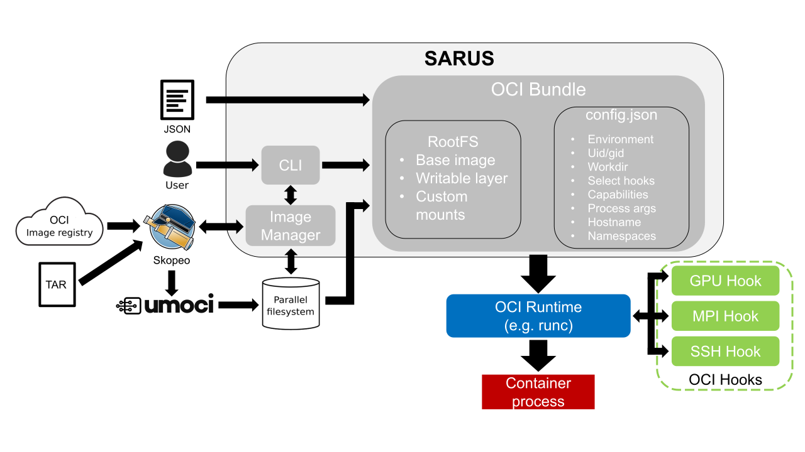
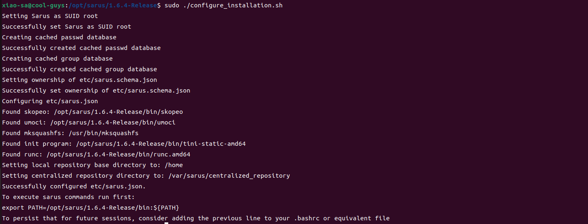
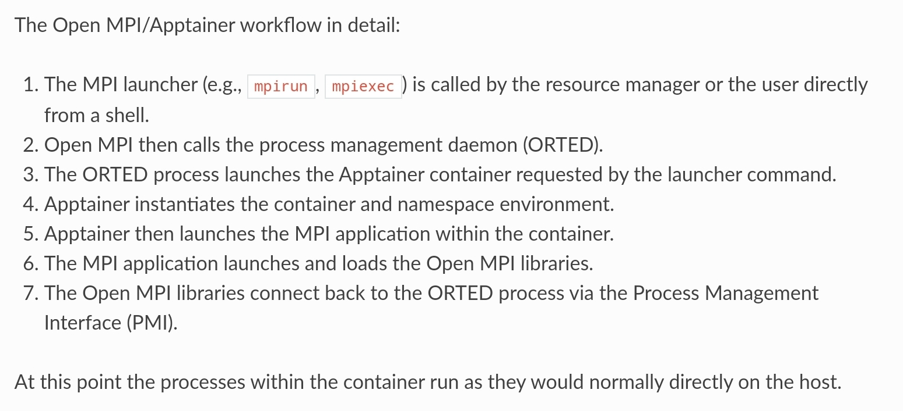

## 深入容器技术


## 复杂环境的容器技术

### sarus与OCI
sarus架构：

注意看OCI Bundle中包含哪些信息
我们可以通过熟悉sarus的组件，进而将OCI的“约定”review一遍


#### layer的再阐述
skope工具是处理“镜像”的，当skope将镜像从镜像仓库拉取下来之后，可以存储为：
* container storage backends
* local directories
* OCI-layout directories
其中local directories是podman等主流容器方案的后端`storage`实现的一种存储形式。

storage主要处理三种类型的对象：
* layer: 一种copy-on-write的文件系统，这个是理解容器运行机制的核心概念，注意：**一个给定的layer只可能有唯一一个parent，但任意的layer可以是多个layer的parent**
* image
* container


#### 容器镜像的处理
将tar文件导入为"可管理的oci bundles"依赖的是`Skopeo`，一个泛用性很强的镜像文件处理工具，最终转换为oci镜像路径（一种标准化的表达）。(注意这是处理容器镜像的工具，但不是container bundles)

skopeo copy docker://opensuse/amd64:42.2 oci:opensuse:42.2

要运行容器，我们实际需要的是container bundle,它包含：
* rootfs
* config file:
  * user id
  * 挂载的镜像
  * 运行的进程
  * ...

umoci实现了OCI image specification，可以实现创建镜像文件等操作：
其中几个比较关键的操作：
* unpack: 从镜像中提取文件系统和配置，变成一个新的oci bundle
* repack: 上述过程的反过程

回顾一下oci image spec:
* layer
* manifests
* config
oci_path属于是`OCI Image Media Types`中的一种，可去`OCI Image Layout Specification`查看

列举一些关于OCI Image layout-spec的重点：
* 给定layout路径以及`ref`，“一些工具”可以依照这个思路创建oci runtime bundle:
  * 通过ref找到`manifest`,通过`image index`(index.json)
  * 按顺序解压layer生成rootfs
  * 将image configuration转换为OCI runtime spec的config.json
* image layout
  * blobs:
    * 包含内容可寻址的blobs
    * blobs下的对象名称由每个哈希算法生成的目录构成，比如sha256(可通过shasum -a file验证),寻址的规则依照`OCI descriptor`提供的`digest`规则；
    * 内容的构成可以参考`media-types`
  * oci-layout
    * 必定存在，且一定为json
    * 包含`imageLayoutVersion`字段
  * index.json
    * 就是通过该文件来确定`image index`的
    * index.json实际是image index的json media type的实例，因此我们主要了解json中各字段的含义
    * manifests: array of objects,存在的目的是保证镜像可以唯一确定其哈希值；允许多个架构/系统的镜像（platform）。digest（指向特定架构的manifest property）其内容包括:
      * mediaType
      * config（descriptor）:指向容器的配置文件，内部包含"config"，"rootfs"（其中包含type以及diff_ids以及hisory），
      * layers: layer descriptor的array

注意：manifest中的config中的`diff_ids`的哈希值不等于各`layers`的哈希值，layer所指示的哈希值是具体文件的哈希值（tarball以及json文件的）,而ids指示的是layer的未经压缩的目录。

简单来说，经过umoci的操作，我们获得了`oci-bundle/runtime-bundle`，紧接着，`runc/crun`等runtime工具这个时候就可以将容器运行起来了

我们来简要分析下runtime-spec的`config.json`包含**重要**的内容：
* process-容器运行进程的信息
  * user
    * uid
    * gid
    * additionalGids
  * args
  * env
  * cwd
  * capabilities（进程能力）
* mounts
  ...


```shell
# 使用skope获取镜像，并以"oci path"存为本地目录
skopeo copy docker://opensuse/amd64:42.2 oci:opensuse:latest
# 从opensuse镜像中提取OCI bundle "bundle"
umoci unpack --image opensuse:latest bundle
# 使用crun生成容器
runc run -b bundle ctr-name
```


#### hook系统

> Sarus allows containers to be customized by other programs or scripts leveraging the interface defined by the Open Container Initiative Runtime Specification for POSIX-platform hooks (OCI hooks for short).


* Native MPI support


#### 安装&使用

```shell
mkdir /opt/sarus
cd /opt/sarus
# Adjust url to your preferred version
wget https://github.com/eth-cscs/sarus/releases/download/1.5.0/sarus-Release.tar.gz
sudo ./configure_installation.sh
```

去看环境搭建的脚本，得知做了这些事情：

* 为sarus的二进制目录下中的文件提权
  * chown root:root bin/sarus
  * chmod  +s bin/sarus
* 将passwd和group信息记录到本地的etc目录下（passwd, group）
* 确保etc/sarus.schema.json的所有权用户为root
* 为配置文件`sarus.json`提供足够的信息
  * 功能组件的文件路径
    * sarus的安装路径
    * SKOPEO的路径
    * UMOCI的路径
    * MKSQUASHFS的路径
    * tini-static-amd64的路径
    * runc的路径
  * local repository base dic
  * centralized repository dic




```shell
$ sarus pull alpine
# image            : docker.io/library/alpine:latest
# cache directory  : "/home/user/.sarus/cache"
# temp directory   : "/tmp"
# images directory : "/home/user/.sarus/images"
# image digest     : sha256:4ff3ca91275773af45cb4b0834e12b7eb47d1c18f770a0b151381cd227f4c253
Getting image source signatures
Copying blob 2408cc74d12b done
Copying config a366738a18 done
Writing manifest to image destination
Storing signatures
> unpacking OCI image
> making squashfs image: "/home/user/.sarus/images/docker.io/library/alpine/latest.squashfs"

$ sarus images
REPOSITORY   TAG          IMAGE ID       CREATED               SIZE         SERVER
alpine       latest       a366738a1861   2022-05-25T09:19:59   2.59MB       docker.io

$ sarus run alpine cat /etc/os-release
NAME="Alpine Linux"
ID=alpine
VERSION_ID=3.16.0
PRETTY_NAME="Alpine Linux v3.16"
HOME_URL="https://alpinelinux.org/"
BUG_REPORT_URL="https://gitlab.alpinelinux.org/alpine/aports/-/issues"
```


### apptainer

#### 为何使用apptainer

下面内容摘自https://researchcomputing.princeton.edu/support/knowledge-base/apptainer#apptainer

* [可复现性，一个bundles包含所有软件依赖]An Apptainer image bundles an application together with its software dependencies, data, scripts, documentation, license and a minimal operating system. Software in this form ensures reproducible results. In fact, a DOI can be obtained for an image for publications. As software dependencies continue to grow in complexity, this approach becomes more attractive.
* [所有内容被包含在一个文件]Apptainer images are stored as a single file which makes them easily shareable. You can host your images on the Singularity Cloud Library for others to download. You could also make it available by putting it on a web server (e.g., tigress-web) like any other file.
* [跨系统]An Apptainer image can run on any system that has the same architecture (e.g., x86-64) and binary file format for which the image was made. This provides portability.
* [glibc的ABI问题]Software built on one system with a certain glibc version may not run on a second system with an older glibc. One may also encounter issues with ABI compatibility, for example, with the standard C++ library. These issues can be solved with Apptainer by building the image with an updated base operating system and the corresponding libraries and tools.
* [更接近硬件]Apptainer can be used to run massively-parallel applications which leverage fast InfiniBand interconnects and GPUs. These applications suffer minimal performance loss since Apptainer was designed to run "close to the hardware".
* Bring Your Own Software (BYOS). That is, you don't have to ask the system adminstrators if they are willing to install something for you. You can install whatever you want inside the image and then run it. This is because there is no way to escalate priviledges. That is, the user outside the container is the same user inside so there are no additional security concerns with Apptainer containers.


#### 执行MPI任务
内容摘自https://apptainer.org/docs/user/main/mpi.html#

apptainer执行MPI任务有两种模式，分别是"Hybrid"和"bind"，区别在于镜像中是否包含MPI软件栈。

hybrid中容器外和容器内都会有运行容器的软件栈，当使用`mpiexec`（或者其他launcher）时，容器外部的mpi进程将会和内部的代码协同工作。整个工作流如下：




### CDI
> CDI is an open specification for container runtimes that abstracts what access to a device, such as an NVIDIA GPU, means, and standardizes access across container runtimes. Popular container runtimes can read and process the specification to ensure that a device is available in a container. CDI simplifies adding support for devices such as NVIDIA GPUs because the specification is applicable to all container runtimes that support CDI.CDI also improves the compatibility of the NVIDIA container stack with certain features such as rootless containers.

Container Device Interface (CDI) 是一个提议的标准，它定义了如何在容器运行时环境中向容器提供设备。这个提议的目的是使得设备供应商能够更容易地将其设备集成到 Kubernetes 集群中，而不必修改 Kubernetes 核心代码。

CDI 插件通常负责：

配置设备以供容器使用（例如，分配设备文件或设置必要的环境变量）。
在容器启动时将设备资源注入到容器中。


#### cuda container
GPU相关的软件栈比较复杂，使用了CUDA技术的软件在部署时通常会面临以下问题：
* 软件支持的CUDA版本和运行系统的版本不对齐
*


#### nvidia container toolkit

