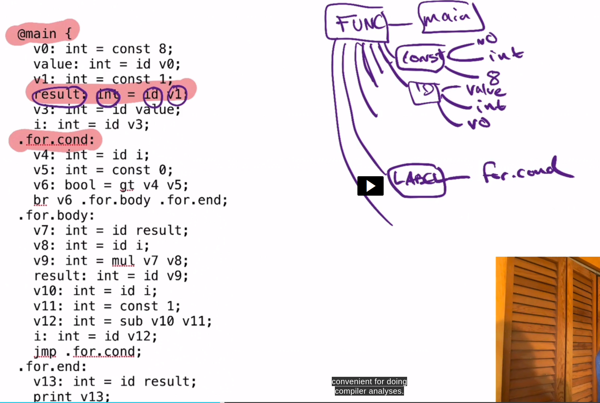
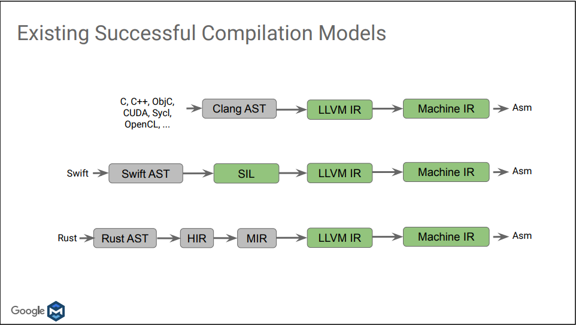
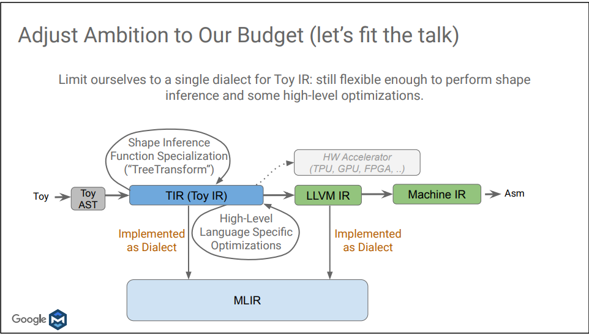
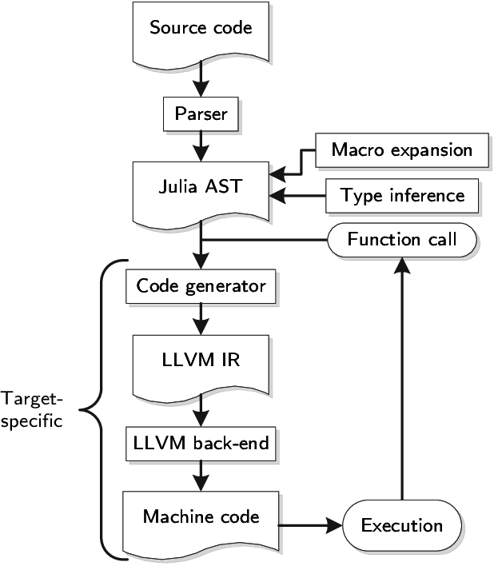
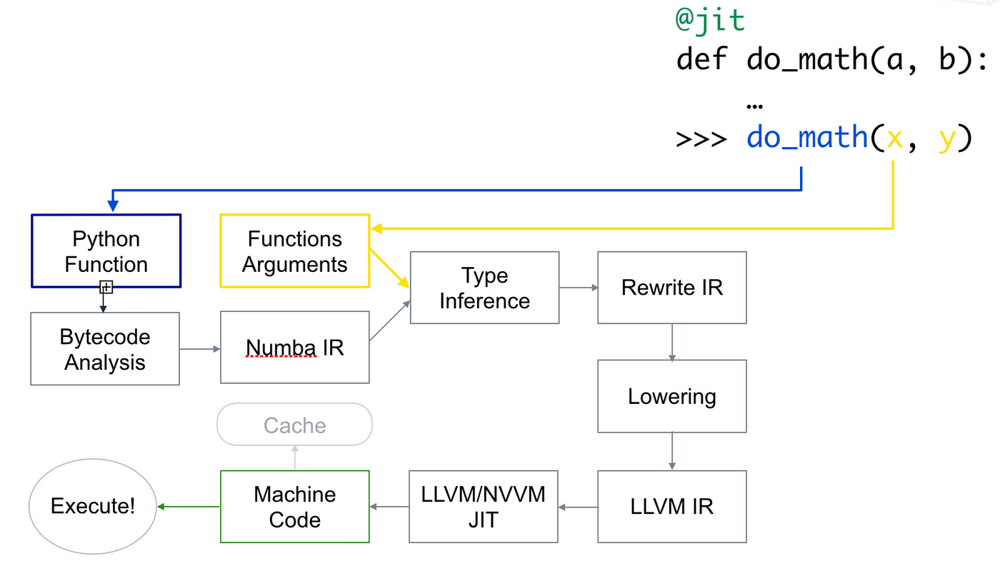
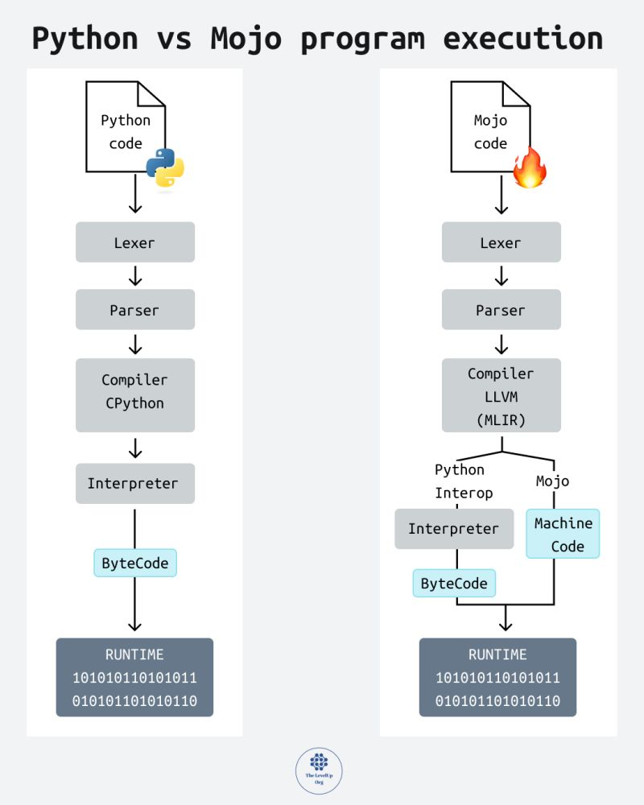
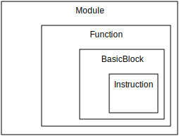

# Programming Language

## 编译后端技术

### 如何代表程序

将源代码转为AST之后，在解释器去执行之前，代码是否会有更加通用的表达形式呢？

这就是中间表示：用指令的序列来表达程序 ？？：是不是有点像汇编

实际上，虽然汇编语言从开发的角度看很不友好，但从CPU的角度来看，这种指令非常的简单好处理，我们可以将两类代码的抽象语法可视化，这样看



从多个角度来看，这样的程序更好分析


#### control flow graph

什么是CFG呢，举例演示：

```assembly
@main {
	v: int = const 4;
	jmp .somewhere;
	v: int = const 2;
.somewhere:
	print v;
}
```

CFG表示中有一个重要概念，叫基本块（Basic Blocks）。

基本块的概念简单来说就是一串指令，这串指令一旦被执行，就会被顺序地被执行直到最后一个指令。

在了解了CFG和basic blocks的概念之后，我们可以写出一个cfg提取器，比如根据某个IR的规则来提取并渲染其控制流图。


### MLIR

MLIR项目是一种构建可重用可扩展的编译器中间表示的工具箱，其一大特点是能够显著降低构建特定领域编译器的成本，改进异构硬件的编译水准。

相关内容的Talks可以看这里： https://mlir.llvm.org/


MLIR有很多成功的典型应用，下面拿我感兴趣的一些项目说明一下：

* [Pylir](https://github.com/Pylir/Pylir)：一个Python的AOT编译器
* [Torch-MLIR](https://github.com/llvm/torch-mlir):Torch-MLIR 项目旨在提供从 PyTorch 生态系统到 MLIR 生态系统的一流编译器支持。
* [VAST](https://github.com/trailofbits/vast):C/C++代码的程序分析框架
* [Mojo](https://docs.modular.com/mojo/)：这个名气挺大，LLVM之父想要用来统一AI技术栈的类Python语言
* [HeteroCL](https://github.com/cornell-zhang/heterocl):多平台编译的基础设施


其他的还有这些：

* TPU-MLIR：面向TPU的机器学习编译器
* XLA：在其中充当计算图的转化框架


可能不少人会想到一个项目——TVM，并好奇TVM和MLIR是什么关系。首先TVM是一个用来加速向量计算的编译器，是一个解决在特定硬件上运行机器学习模型的完整的端到端方案，可以将模型编译为特定的硬件设备上的模型文件，然后在部署侧上安装tvm runtime，就可以完成高性能的部署了。在TVM的整个优化流里，自定义了一种中间语言：Relay


#### MLIR教程

LLVM 在特定领域语言方面的成功激发了 LLVM 内的新项目来解决它们所产生的问题。最大的问题就在于一些DSL生成LLVM-IR的成本太过于昂贵（必须要在前端下十分大的功夫），为了解决这个问题的一个解决方案便是Multi-Level Intermediate Representaion，即MLIR。


这个教程的overview：

* 如何构建一个玩具语言
* MLIR的核心概念：operations, regions, dialects
* 使用MLIR去表示玩具语言
  * 介绍dialect, operations, ODS, verifications
  * 为常规的operations去绑定特定语义
* 特定优化的高级语言
* 为结构而不是ops写特定的passes
* 降级到LLVM-IR


常见的编译流程图：



AST -> LLVM-IR


Toy Compiler的编译流程：



“Dialect”译为方言，是MLIR中的灵魂所在，

#### MLIR上手实践
接下来要做是将官方文档里的toy example给走一遍，为此，我们需要：
* clone llvm, build mlir
* 


## LLVM

大家或多或少都应该听过LLVM或者说是接触过LLVM相关的生态。我认为LLVM实际上是一种框架，或者是一套编译技术的工具集合，其特点是“可编程”。比方说，RUST，SWIFT，Julia这几门当前比较“新颖”的计算机语言，其后端部分都使用了LLVM-IR，算是使用了这个工具箱，LLVM帮助解决的最大问题是平台兼容性：LLVM库可以以可编程的方式生成机器码，开发者可以使用API来生成IR，然后编译IR，快速执行。

举个例子，大多数的计算机语言都会有函数，全局变量的概念，不少会有CFFI，协程等概念，LLVM有相应的IR，以及相应的metaphors。因此你不需要重新造轮子。

以C语言作类比是一个理解LLVM的不错方法，C是构造系统的一个非常合适的计算机语言，因为C的各种抽象非常接近硬件的API，C语言的表达是完成这些映射的最简表达。但是C语言。。。

LLVM主要用作三种场景：

* 构造AOT编译器（clang）
* 构造JIT编译器(julia, numba)
* 自动代码优化
* 构造DSL（WASM，MLIR）


### 依托LLVM的项目

如果你研究编译器/性能工程/并行系统，那么你很有可能被引导至和llvm相关的课题上；就像你研究函数式编程，一定会被叫去研究Haskell一样...

* [rust](https://stackoverflow.com/questions/42626107/execute-llvm-ir-code-generated-from-rust-python-source-code)
* [julia](http://web.mit.edu/julia_v0.6.2/julia/share/doc/julia/html/en/devdocs/reflection.html)
* mlir/tvm
* [mojo](https://docs.modular.com/mojo/why-mojo.html)
* [numba](github.com/numba/llvmlite)


rust和julia会选择使用LLVM-IR及配套后端来生成机器码，关键原因在于：

* 性能优化：LLVM提供了广泛的优化技术，可以生成高性能的机器码；
* 扩平台：LLVM-IR是和平台无关的，从而语言可以不必关心代码生成方面的细节；
* 生态丰富：LLVM有庞大的社区和生态系统，丰富的工具库可以有助于项目演进。


作为一个学生来研究llvm项目，有助于加深你对编译原理/体系结构这两大方向内容的理解。另一方面，研究程序分析/language binding，llvm也是难以回避的话题和工具。关于研究LLVM的意义，这里引用CS6120课程中的部分：

> 当您需要对程序进行操作时，编译器基础结构非常有用。根据我的经验，这是很多。您可以分析程序以查看它们执行某些操作的频率，将它们转换为更好地与您的系统一起工作，或者更改它们以假装使用您假设的新体系结构或操作系统，而无需实际制造新芯片或编写内核模块。对于研究生来说，编译器基础结构通常比大多数人认为的更合适。我鼓励您在使用这些工具之前先默认使用LLVM。


再看下julia和numba的运行过程，这两者是llvm-jit编译器的典型。


#### julia

julia代码执行的过程非常有趣，但这里我们只关心[JIT代码生成的部分](http://web.mit.edu/julia_v0.6.2/julia/share/doc/julia/html/en/devdocs/eval.html#dev-codegen-1)，即将AST（抽象语法树）转换为的过程。

julia中的方法通过emit_function(jl_method_instance_t*)而被转换为native函数。实现部分可以看`codegen.cpp`，[链接](https://github.com/JuliaLang/julia/blob/master/src/codegen.cpp)。这个文件其余的部分大多是对特定的代码模式进行"手动"优化




#### numba




#### mojo




我认为从编程语言的角度来说，学习LLVM以及编译原理中IR这一块的知识，能够帮助开发者不要陷入一种迷茫：现在五花八门的语言有那么多，比如rust和mojo，我们是不是要每个都学习以后会用得上。因为了解了LLVM，你就能对现代编译器是生成机器码的原理有所认识，对高性能的代码生成有所认识，当有人说"xx语言性能好，学他"的时候，你就不会有如果不学习就落后的这种顾虑，因为你清楚这些性能优化背后的原理，在这之后你对项目所使用技术的选项，更多考虑的是在这种开发场景下，哪种语义，标准库，范式的编程语言是比较好的选择。


### 编译安装LLVM

#### 源码安装(cmake)

llvm一个典型的强依赖于cmake build system的结构的项目群，有几个关键变量得说明一下：

```shell
git clone https://github.com/llvm/llvm-project
mkdir build
cd build
cmake -DCMAKE_BUILD_TYPE=Debug -DLLVM_USE_SPLIT_DWARF=ON -DLLVM_OPTIMIZED_TABLEGEN=ON -DLLVM_TARGETS_TO_BUILD="X86" -DBUILD_SHARED_LIBS=ON ../llvm
make -j 12
# 
```


#### 包管理器
我们用的最多的应该是clang相关的工具，可以使用
```
apt-get install clang
```
安装clang以及llvm依赖项


### why hack llvm
下面内容主要取自康奈尔大学一名PL教授的[博客](cs.cornell.edu/~asampson/blog/llvm.html)

为什么要研究类LLVM—对于**研究程序本身**的工作者而言，编译器基础设施的研究价值很大，比如说，你可以分析程序中某种常见的模式。在研究下列工具之前，你可以先接触LLVM：
* 架构模拟器(比如[gem5](research.cs.wisc.edu/vertical/papers/2014/wddd-sim-harmful.pdf))
* 动态二进制插桩工具(比如[pin](intel.com/content/www/us/en/developer/articles/tool/pin-a-dynamic-binary-instrumentation-tool.html))
* 源码转换工具（涉及到AST的解析以及序列化的）
* 内核攻击/系统调用拦截工具


### 用LLVM写PASS



上图展示的是LLVM库中一个IR对象的层级结构，这种包含关系可以被理解为C++容器之间的包含关系。

同样的，这一章节我们使用的材料是cs6120这门课程老师博客中的一篇博文，当然也是课程中第七节内容的节选，足以让我们对LLVM PASS有个初步的认识，最重要的是能让我们上手完成PASS开发的实践。


#### 获取skeleton项目
```shell
git clone https://github.com/sampsyo/llvm-pass-skeleton.git
```

注意你可以根据自己的LLVM版本去切换对应的历史版本（最新版本一直使用的是LLVM-17）

后面步骤可以根据项目README或者博客内容来自己试一遍。


### 用LLVM实现一门语言

这个课题下，我们最应该关注的内容包括：
* llvm万华镜
* julia
* numba

由于mojo当前仍属于闭源阶段，另一方面它使用的更多的是mlir这个依托llvm发展出来的工具开发的，因此不是重点参考对象。


## compiler principle

### 语言的一些设计

#### enumerations

##### C/C++


##### python


## Create a lang

### Monkey


### Porth

#### 简述

> Stack-based编程语言是指在程序执行期间，所有的变量和操作数都通过一个栈数据结构来传递和处理的编程语言。这些语言的代码通常由一系列指令序列组成，每条指令都会从栈中取出一个或多个参数，并将结果压回栈中。这些指令可以用于执行各种操作，例如算术运算、逻辑运算、函数调用、变量赋值等等。Stack-based编程语言通常被设计为非常简洁和易于理解，因为它们的语法和语义都非常直观。由于栈数据结构的特性，这些语言的执行速度通常很快，并且它们不需要像其他语言一样频繁地进行内存分配和释放操作，因为它们的所有变量和操作数都存储在栈中。一些常见的Stack-based编程语言包括Forth、PostScript、Factor、Joy等等。

然后，Porth很像Forth，也是一门stack-based的语言。


### Python-v1


### Python-v2


